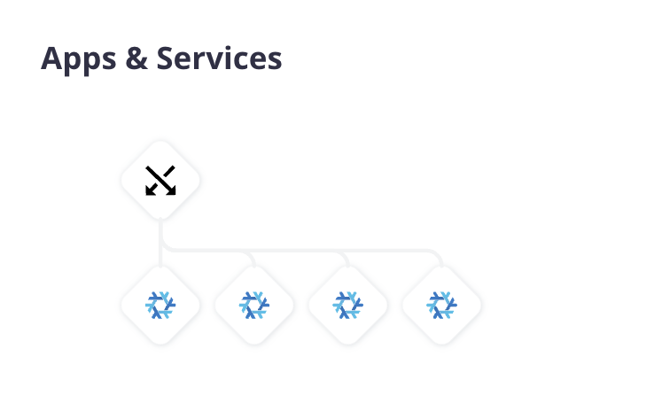

<p align="center">
<a href="https://www.upsun.com/">

</a>
</p>

<p align="center">
<a href="https://github.com/platformsh/demo-project/issues">

</a>&nbsp&nbsp
<a href="https://github.com/platformsh/demo-project/pulls">

</a>&nbsp&nbsp
<a href="https://github.com/platformsh/demo-project/blob/main/LICENSE">

</a>&nbsp&nbsp
<br /><br />

<p align="center">
<strong>Contribute and check out our resources!</strong>
<br />
<br />
<a href="https://discord.gg/PkMc2pVCDV"><strong>Join us on Discord</strong></a>&nbsp&nbsp&nbsp&nbsp&nbsp&nbsp
<a href="https://upsun.com/"><strong>Website</strong></a>&nbsp&nbsp&nbsp&nbsp&nbsp&nbsp
<a href="https://upsun.com/features/"><strong>Features</strong></a>&nbsp&nbsp&nbsp&nbsp&nbsp&nbsp
<a href="https://docs.upsun.com"><strong>Documentation</strong></a>&nbsp&nbsp&nbsp&nbsp&nbsp&nbsp
<a href="https://upsun.com/pricing/"><strong>Pricing</strong></a>&nbsp&nbsp&nbsp&nbsp&nbsp&nbsp
<a href="https://upsun.com/blog/"><strong>Blog</strong></a>&nbsp&nbsp&nbsp&nbsp&nbsp&nbsp
<br /><br />
</p>

<h2 align="center">Try the Upsun JS demo</h2>

## About

This is a simple demo project meant to introduce you to working with Javascript runtimes on [Upsun](https://upsun.com).

It leverages the [https://docs.upsun.com/create-apps/app-reference/composable-image.html](composable image) application container syntax, which is built on [Nix](https://nix.dev/) and [Nixpkgs](https://search.nixos.org/packages) under the hood. 

```bash
.
├── .git
├── .gitignore
├── .upsun
│   └── config.yaml
├── README.md
├── bun
│   └── ...
├── deno
│   └── ...
├── main
│   └── ...
├── nodejs
│   └── ...
└── utils
```

It is comprised of four [application containers ](https://docs.upsun.com/create-apps.html)

<p align="center">

</p>

## Getting started

If you already have access to Upsun:

- Visit the Upsun Console (https://console.upsun.com/projects/create-project) to create a new project
- Create or select an organization to run the demo on
- Click **Explore Upsun** to start the demo

